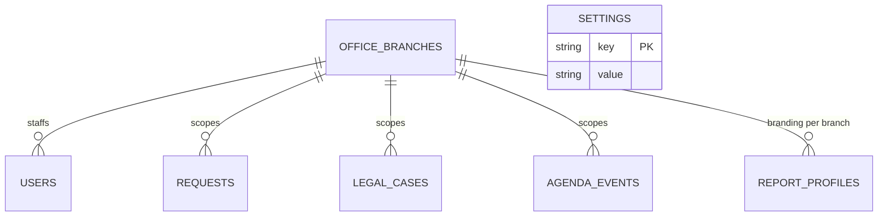
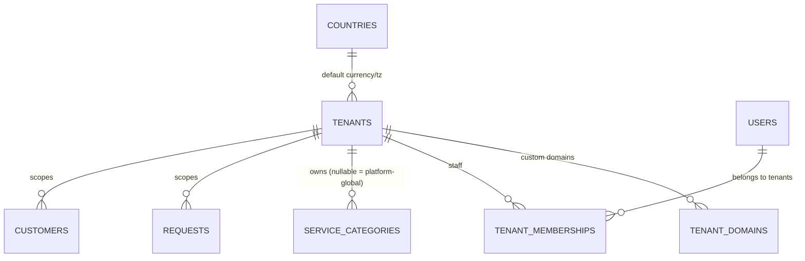
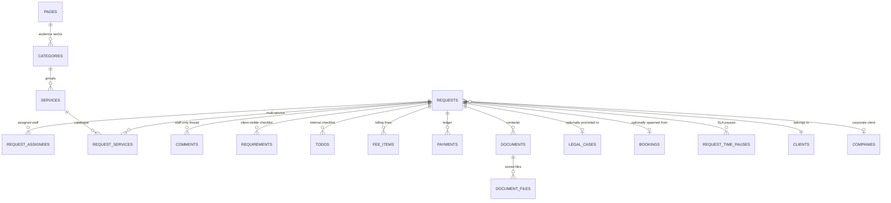
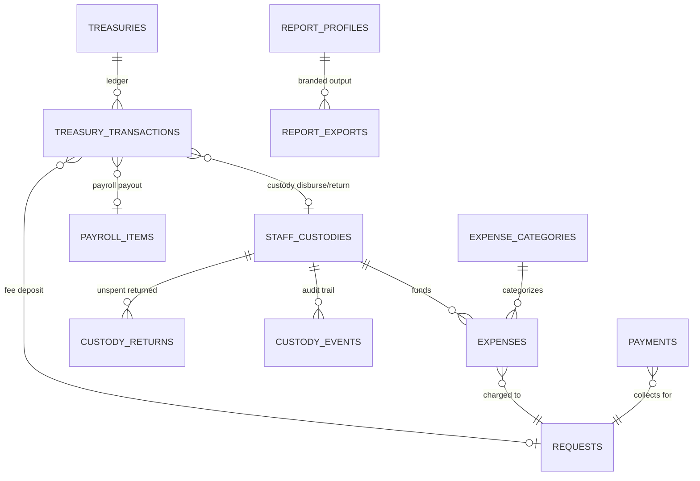
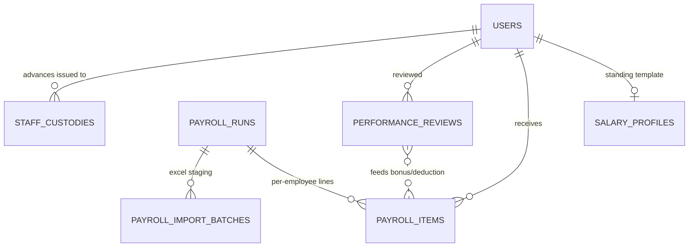
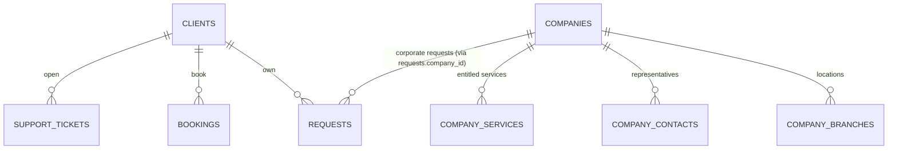
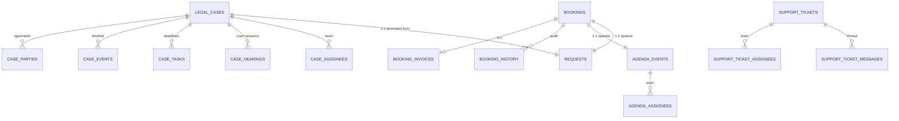
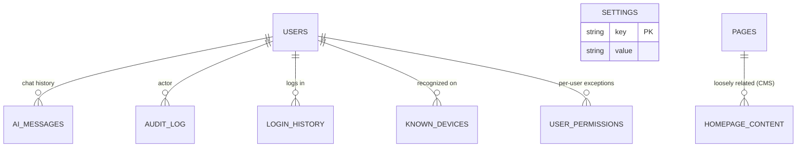

# 13 — Database Schema & Entity Relationship Diagrams

Source: all 58 files under `db/migrations/` (either read in full or
confirmed via a repo-wide `grep "CREATE TABLE"` to contain no missed
table), `db/catalogue.js` (confirmed seed data, not schema), and
`db/postgres/001_foundation.sql`.

## Critical finding: two schemas exist, and they are not the same architecture

1. **`db/migrations/001_baseline.js` → `058_ai_chat.js`** (SQLite via
   `better-sqlite3`) — **the real, currently-running schema.** Integer
   autoincrement PKs, no `tenants` table, single-tenant-per-deployment
   (see `04-company-branch-tenant-model.md`), multi-*branch* support
   bolted on very late (migration 055). ~82 live tables + 1 FTS5 virtual
   table.
2. **`db/postgres/001_foundation.sql`** — **not** a replay/export of the
   SQLite history. It's a separate, smaller (16 tables), aspirational
   **target re-architecture**: UUID PKs, a real `tenants`/
   `tenant_domains`/`tenant_memberships` model, Postgres ENUMs, and
   row-level-security policies keyed on `current_tenant_id()`. Confirmed
   by diffing against the SQLite baseline — completely different table
   names, no shared lineage.

**For the blueprint**: the Postgres file is effectively the team's own
draft of "what a true shared-database multi-tenant white-label
architecture should look like" — useful as a **target-state reference**,
but must never be presented as "the current Sanad schema." It also covers
only the platform/tenant/catalog/request/quote/CMS/audit core — it has
**no** payments/treasury/payroll/HR/cases/bookings/support-tickets/
documents tables. Those modules would need fresh design for that target
architecture, using the SQLite modules below as the functional spec.

## Part A — current SQLite schema, by module

### 1. Auth / Users / Staff
`users` (central identity, `role` free-text, `is_super_admin` flag),
`sessions`, `audit_log`, `login_history`, `known_devices`,
`password_resets` (shared staff+client, `audience` column), `user_permissions`
(per-user exceptions only, `ON DELETE CASCADE`), `login_throttle`,
`office_branches`, `platform_access_nonces`.

### 2. Clients
`clients`, `companies`, `company_branches`, `company_contacts`,
`company_services` (join), `contacts` (the office's **own** published
contact channels — not client data).

### 3. Request / Workflow (the core ticketing engine)
`requests` (extended by nearly every migration — the single most
evolved table), `request_notes` (early, largely superseded by
`comments`), `request_assignees` (rebuilt for cascade-delete),
`request_assignee_shares`, `request_services` (multi-service join),
`request_destinations`, `request_time_pauses`, `comments` (2-level
threaded, staff-only), `requirements` (the one client-visible checklist),
`todos`, `todo_templates` (created then dropped — dead), `destinations`,
`trips`, `fee_items`, `trash` (polymorphic soft-delete), `data_import_batches`,
`requests_fts` (FTS5 full-text search, trigger-synced).

### 4. Documents / Files
`documents` (named container), `document_files` (actual stored files,
with purge fields).

### 5. Finance / Treasury
`payments`, `expenses`, `expense_categories`, `staff_custodies`,
`custody_returns`, `custody_events`, `custody_return_requests`
(scaffolded, unused), `treasuries`, `treasury_transactions` (the central
money-movement hub), `report_profiles`, `report_exports`.

### 6. HR / Payroll
`salary_profiles`, `payroll_runs`, `payroll_items`,
`payroll_import_batches`, `performance_rules`, `performance_reviews`
(feeds payroll bonuses).

### 7. Cases (legal practice)
`case_categories`, `legal_cases` (1:1 with `requests`), `case_assignees`,
`case_hearings`, `case_tasks`, `case_events`, `case_parties`.

### 8. Agenda / Support Tickets
`agenda_events`, `agenda_assignees`, `support_tickets`,
`support_ticket_assignees`, `support_ticket_messages`,
`support_ticket_events`.

### 9. Bookings / Consultations
`consultation_modes`, `booking_slots`, `bookings` (1:1:1 pivot to
`requests` and `agenda_events`), `booking_history`,
`booking_client_notifications`, `booking_invoices`.

### 10. Notifications / Mail
`notifications`, `mail_log`.

### 11. Settings / CMS / Homepage
`settings` (generic key/value), `social_links`, `pages`, `categories`,
`services`, `homepage_sections`, `homepage_metrics`, `homepage_content`,
`testimonials`, `homepage_faqs`.

### 12. AI
`ai_messages`.

### Renamed/superseded tables (historical only, not separate live entities)
`clients_new`→`clients`, `request_assignees_new`→`request_assignees`,
`user_permissions_new`→`user_permissions` (all rebuilds to add
`ON DELETE CASCADE`); `todo_templates` (created migration 007, dropped
migration 008 — a scrapped feature).

## Part B — Postgres reference schema (target architecture)

16 tables, `sanad` schema, `pgcrypto`+`citext`: `countries`, `tenants`
(the real multi-tenant root — **does not exist in the live SQLite app**),
`tenant_domains` (custom-domain/white-label routing), `users` (global
identity, not tenant-scoped itself), `tenant_memberships` (composite PK,
JSONB permissions — replaces SQLite's role-string + override-table
model), `service_categories`, `services`, `service_versions` (full
version history — no SQLite equivalent), `customers` (merges individual/
company into one polymorphic table, unlike SQLite's separate
`clients`/`companies`), `requests` (a much richer `request_status` ENUM
state machine — draft/submitted/initial_review/missing_information/
ready_for_quote/quote_sent/quote_revision/quote_rejected/quote_accepted/
awaiting_advance/in_progress/completed/closed/cancelled/refund_review/
disputed — vs. SQLite's flat 7-value status string), `request_status_history`
(formal transition audit — no SQLite equivalent), `quotes`/`quote_items`
(a formal quote/approval workflow — **no equivalent exists in SQLite**,
which only has flat `fee_items`), `cms_sections` (generalized, tenant-
overridable version of SQLite's `homepage_sections`/`homepage_content`/
`pages` combined), `audit_events`.

**If a white-label rebuild wants genuine shared-database multi-tenancy
with a richer request state machine and formal quotes**, this Postgres
file is the right starting skeleton — but it needs the finance/HR/cases/
bookings/support modules designed fresh, using Part A as the functional
spec for what each module needs to do.

## Part C — ERD groupings (Mermaid)

### Platform / Tenant ERD (current — thin; mostly `office_branches`)

### Platform / Tenant ERD (target — Postgres reference)

### Request / Workflow ERD

### Finance ERD

### HR / Payroll ERD

### Client ERD

*(Compare against the Postgres target's unified `customers` table, which
merges individual and company into one polymorphic entity — a genuine
simplification a white-label rebuild might want to adopt.)*

### Cases / Agenda / Bookings / Support ERD ("Operations")

### AI / Settings / Audit ERD

